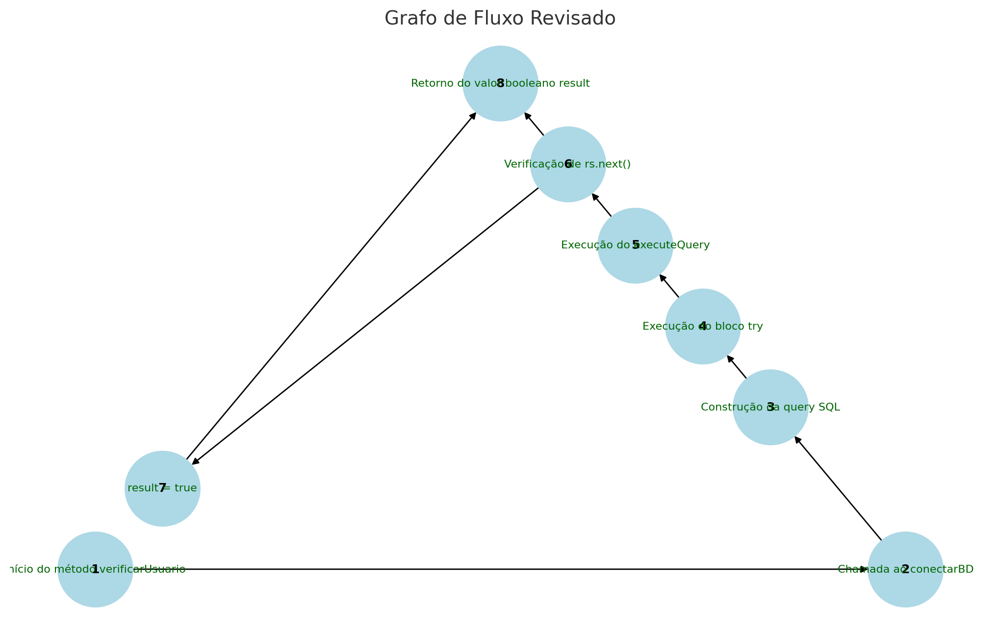

# Etapa 3 

## Grafo de Fluxo

## Complexidade Ciclomática
**Fórmula utilizada:**  
A fórmula é:

𝑀
=
𝐸
−
𝑁
+
2
M=E−N+2
Onde:

E: Número de arestas = 8.
N: Número de nodos = 8.
Substituindo:

𝑀
=
8
−
8
+
2
=
2
M=8−8+2=2
Complexidade Ciclomática: 2

## Caminhos Básicos Identificados
Com base no grafo, os caminhos básicos identificados são:

Caminho 1 (Login válido):

1 → 2 → 3 → 4 → 5 → 6 (true) → 7 → 8
Caminho 2 (Login inválido):

1 → 2 → 3 → 4 → 5 → 6 (false) → 8